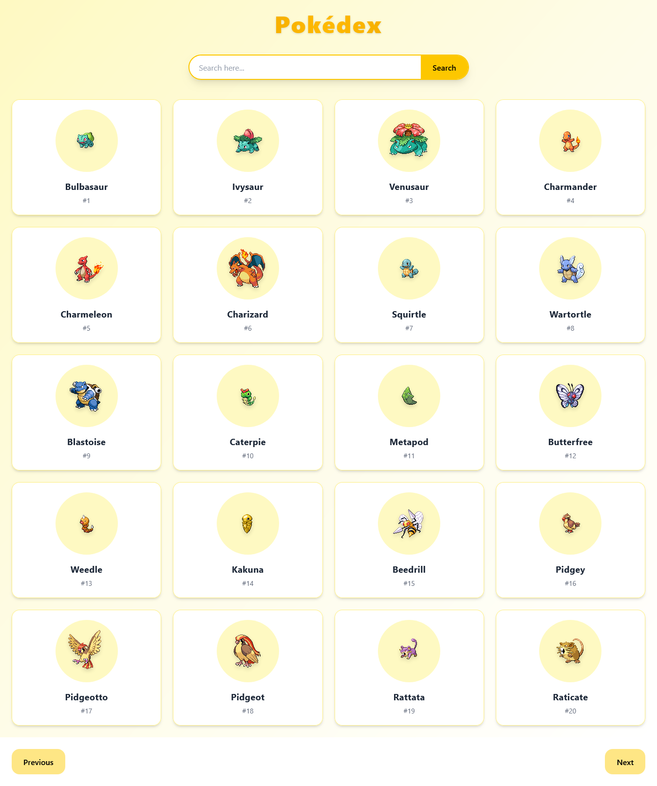
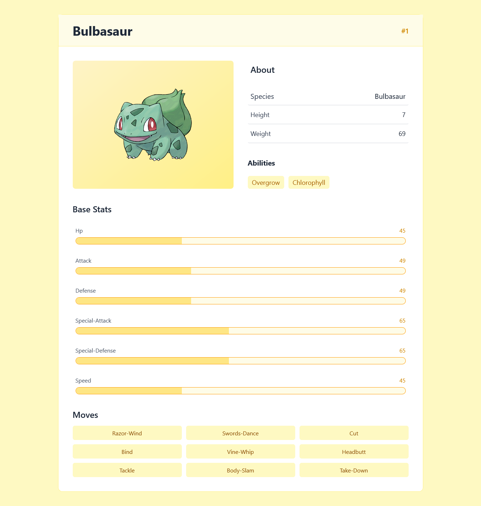
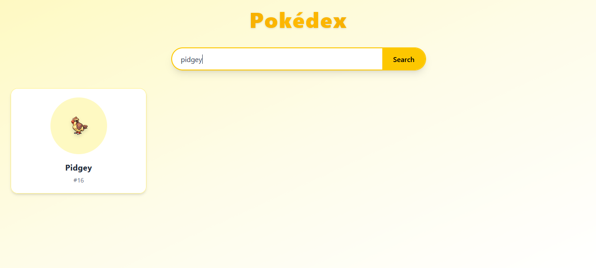

# ✅ PokeDex – Pokémon Explorer App

A fully responsive and interactive PokeDex App built using React JS, Tailwind CSS, and powered by the PokeAPI via an Express JS backend.

This app allows users to browse Pokémon with pagination, perform live search, and view detailed information with smooth animations and a clean UI. 

## 📸 Screenshot  

<table align="center">
<tr>
  <th>Preview-1</th>
  <th>Preview-2</th>
</tr>
<tr>
  <td align="center">
    
  </td>
  <td align="center">
    
  </td>
</tr>
</table>

<br/>

<table align="center">
<tr>
  <th>Preview-3</th>
</tr>
<tr>
  <td align="center">
    
  </td>
</table>

---

## 🌐 Live Demo  

The project is live and can be viewed here :  [Pokedex](https://pokedex-eta-ruby.vercel.app/)

---

## ✨ Features
### 🏠 Home Page
- 🔍 Live Search Bar (filters Pokémon instantly while typing)
- 🃏 Pokémon displayed using Grid Card Layout
- 📸 Each card shows:
    - Pokémon Image
    - Name
    - ID
- 🖱️ Clicking a card navigates to detailed info page
- ⏭️ Next & Previous Buttons (Pagination support)
- 📱 Fully responsive grid layout

### 📄 Pokémon Info Page
- 📸 Pokémon Image
- 🔢 ID
- 🏷️ Name
- ℹ️ About Section:
    - Species
    - Height
    - Weight
    - Abilities
- 📊 Base Stats displayed using animated progress bars
- ⚔️ Moves list

---

## 🛠️ Technologies Used

- React JS (with Hooks)
- Tailwind CSS
- JavaScript (ES6+)
- HTML5
- React Router DOM
- Express JS (Backend API handling)
- PokeAPI (External Pokémon Data API)

---

## ⚙️ Backend (Express JS)

- Fetches Pokémon data from PokeAPI
- Handles API requests securely
- Manages pagination logic
- Sends processed data to frontend
  
--- 

## 📂 Project Structure

```bash
pokemon-hub/
├── frontend/
│   ├── public/
│   │   └── Screenshots/
│   │       ├── home.png
│   │       └── info.png
│   │
│   ├── src/
│   │   ├── components/
│   │   │   ├── Home.jsx
│   │   │   ├── Info.jsx
│   │   │   └── StatsBar.jsx
│   │   │
│   │   ├── App.jsx
│   │   ├── main.jsx
│   │   └── index.css
│   │
│   ├── package.json
│   └── vite.config.js
│
├── backend/
│   ├── server.js
│   ├── package.json
│ 
│
└── README.md
```

---

## ⚙️ Getting Started

Follow these steps to run the project locally:

### Clone the repository
```bash
git clone https://github.com/aru-shi2/Pokemon-hub.git

```

### Navigate to project directory 
```bash
cd Pokemon-hub
```
### Install Frontend Dependencies
```bash
npm install 
```

### Install Backend Dependencies
```bash
cd backend
npm install
```

### Start Backend Server
```bash
npm run start
```

## Start Frontend Development Server
```bash
npm run dev
```
